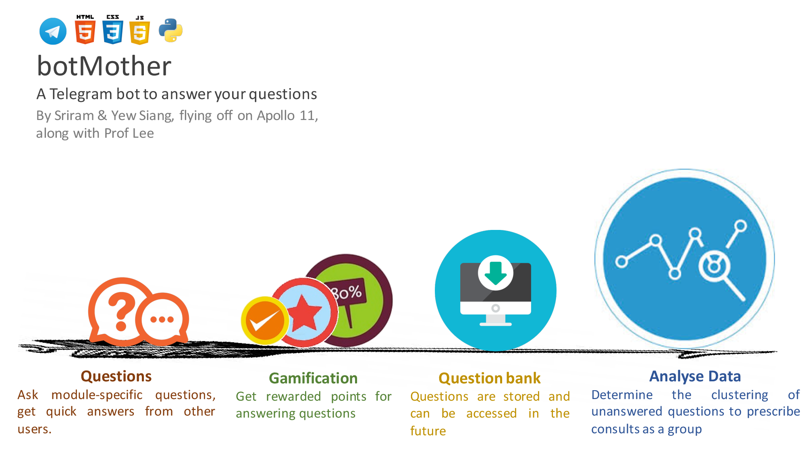
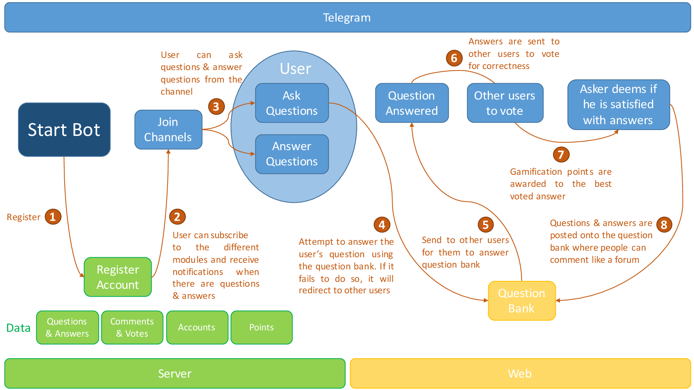

#**BotMother**

##**A Chat-Based Forum System**

By Sriram Sami and Tang Yew Siang

##**Motivation**

When you’re stuck with a burning **question** in one of your modules, or just want **general advice** about the module itself, your current alternatives are friends, seniors and perhaps the IVLE forums.

Many may have reached the point where either their friends and seniors **don’t know** the answer, or it’s **inconvenient** to ask them, and the IVLE forums are either too **slow** a medium or it’s just strange to post your question there. The question is also **too module-specific** for Google to help you out. Also, you’re sure that someone has asked the question and gotten an answer before, so why isn’t there a record of it somewhere so you don’t have to waste time _asking the same thing again_?

##**Aim**

We hope to make the Q&A process in forums quick and engaging through messaging platforms (e.g. Telegram).

##**User Stories:**

1.  As a student who has questions and problems with a module, I want to be able to ask questions and get quality answers quickly.
2.  As a student who is revising for exams, i want to be able to look at the good questions and answers of the module over the years.
3.  As a student, teaching assistant or professor who wishes to help students, I want to be able to answer posed questions in a timely manner.
4.  As an administrator who wants to prevent abuse of the system, I want to be able to identify abusers, warn them and ban them if they continue to cause problems.

##**Scope of Project:**

The **Telegram Bot** provides a chat-like interface for students to ask questions and their peers, teaching assistants or professors to answer quickly.

A **Web-based forum** will share a common database with the Telegram Bot and provide the same functionality with a traditional non-chat-based interface.

Features to be completed by the mid of June:

1.  Telegram Bot
    1.  Allow users to ask, answer, vote on module-specific questions
    2.  Display **new** questions and answers

The Telegram bot has limited features (cannot display all questions and answers, cannot comment) due to limited screen space and the potential notification spam.

1.  Web-based forum
    1.  Allow users to ask, answer, vote and **comment** on module-specific questions
    2.  Display **all** questions, answers and comments
2.  Mechanisms to collect datasets to allow for analysis

Features to be completed by the mid of July:

1.  Gamification system
    1.  Reward users with points for good questions and answers
2.  Providing recommendations with machine learning

##**How are we different from similar platforms?**

1.  IVLE Forums

*   As BotMother does not require your NUSNET account, questions are not tagged to your real name if you choose so. Also, we plan to give you fast-paced responses due to the nature of a primarily **chat-based** forum system, as opposed to a more static medium.

1.  StackOverflow/StackExchange

*   We encourage questions about homework which are frowned upon in these traditional online forums. In fact, module-specific questions are the backbone of the platform.

1.  Quora

*   Questions asked here can be too general

##**Program Flow**

##**Providing Recommendations with Machine Learning**

Over time, two things happen in our system:

*   Reliable questions and answers are stored in the question bank
*   Users who ask questions receive recommended answers from the question bank and can indicate if the recommended answer is relevant, correct and precise.

We constantly run a machine learning algorithm that looks at these three parameters: i.e.

*   the **question being asked,**
*   the **question and** **answer being recommended** as most relevant, and
*   **the user’s rating of the provided recommendation**

and improves its model of _“what is a relevant answer?”_ This, over time, helps the system provide increasingly more accurate recommendations.

##**Proposed Level of Achievement**

Apollo 11

##**Project Log**

| S/N | Task | Date | Sriram (hrs) | Yew Siang (hrs) | Remarks |
| --- | --- | --- | --- | --- | --- |
| 1 | Liftoff Day 1 | 9/5/2016 | 8 | 8 | Liftoff Day 1 |
| 2 | Liftoff Day 2 | 10/5/2016 | 8 | 8 | Liftoff Day 2 |
| 3 | Team meeting & initial planning | 14/5/2016 | 10 | 10 | 1) Layout the full idea for the project and the technology required |
| 4 | Team meeting: Implementation details and initial project structure | 15/5/2016 | 12 | 12 | 1) Discussed implementation features in depth |
| 5 | Mission Control | 17/5/2016 | 1 | 1 | 1) Met with mentor Prof Lee Wee Sun to discuss our ideas and the possible implementation of machine learning |
| 6 | Programming at home: | 21/5/2016 | 2 | 2 | 1) Develop database models |
| 7 | Programming at home: | 22/5/2016 | 4 | 4 | 1) Develop database models |
| 8 | Programming at home: | 23/5/2016 | 1 | 1 | 1) Develop database models |
| 9 | Programming at home: | 24/5/2016 | 2 | 2 | 1) Develop different database functions |
| 10 | Team meetting | 28/5/2016 | 10 | 10 | 1) Worked on Milestones |

| Total Hours | Sriram | Yew Siang |
| --- | --- | --- |
| 116 | 58 | 58 |

##**Licensing**
This project is licensed under the GNU Affero General Public License, view LICENSING.MD
for more details.
